# Git Setup

This guide will walk you through installing **Git** and **TortoiseGit** on Windows.

You only need to do this once.  
Follow every step carefully and use the screenshots to check you are on the right screen.

---

## Step 1: Download Git for Windows

Go to the official download page:

[https://git-scm.com/install/windows](https://git-scm.com/install/windows)

Click the link hightlited by the red box

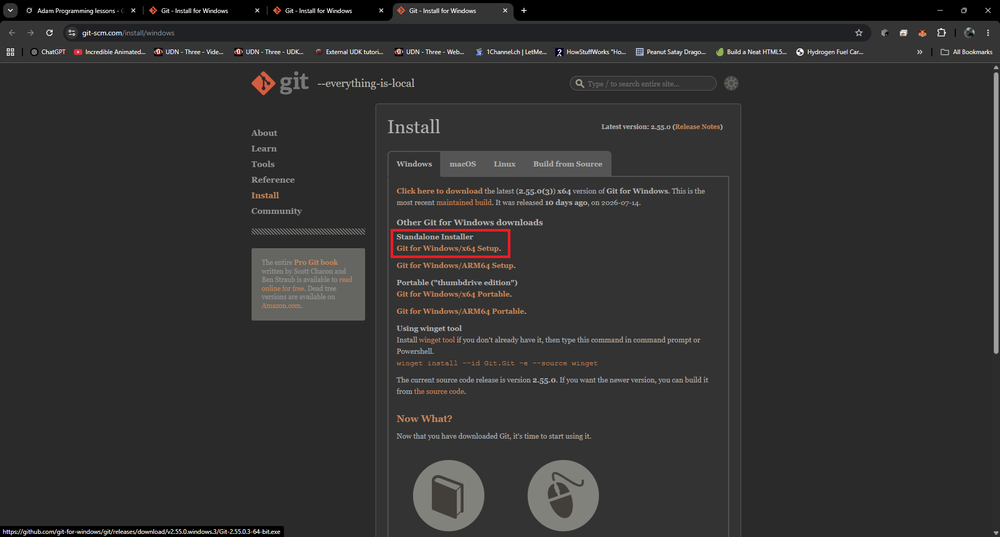

---

## Step 2: Run the Git Installer

Find the downloaded file (usually in your Downloads folder) and double-click it.

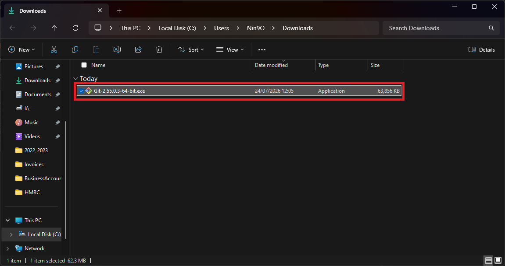

---

## Step 3: Run the Git Installer

Follow the screens as I have done.

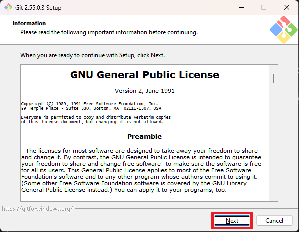
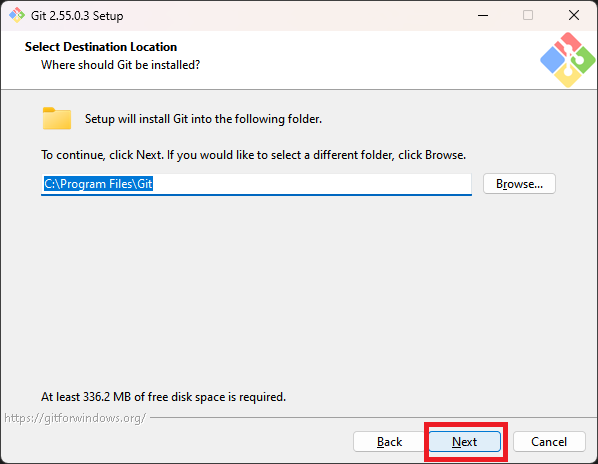
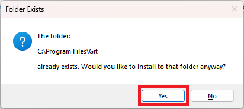
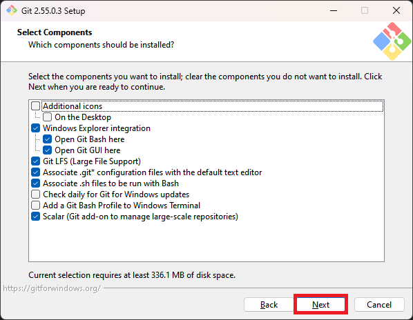
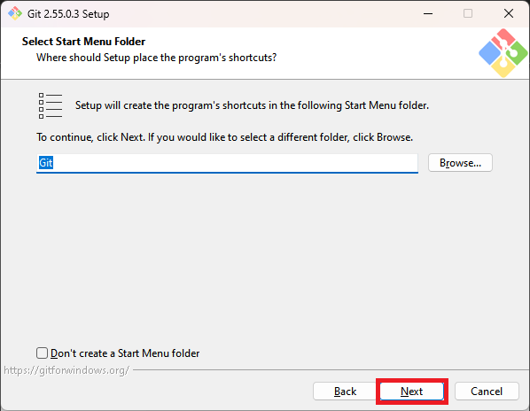
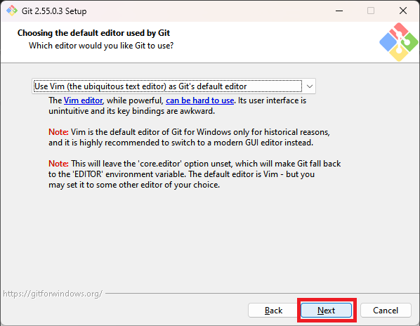
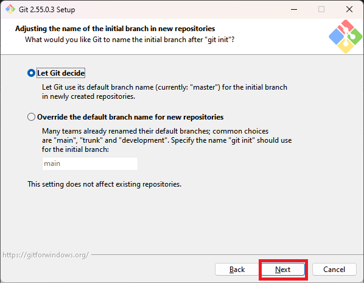
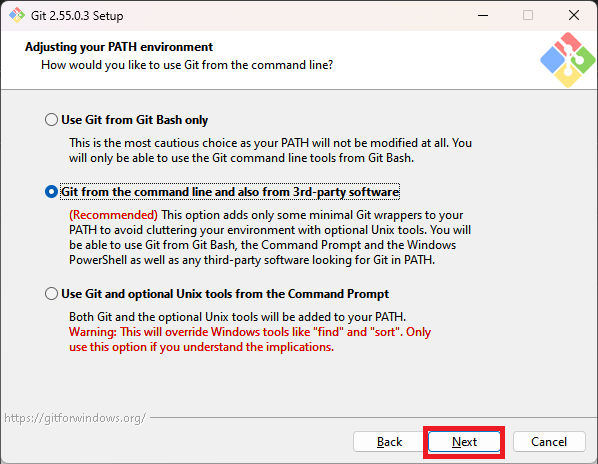
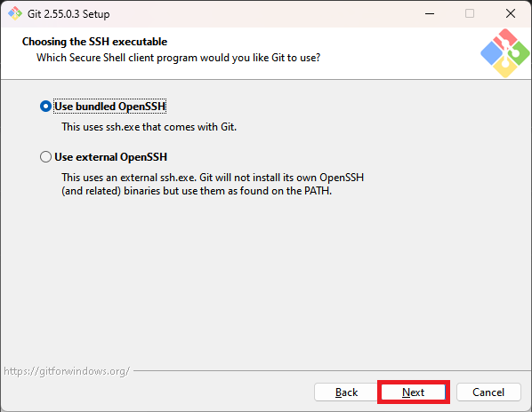
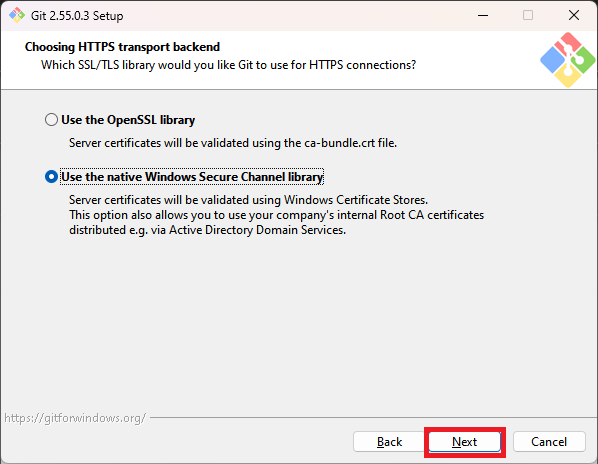
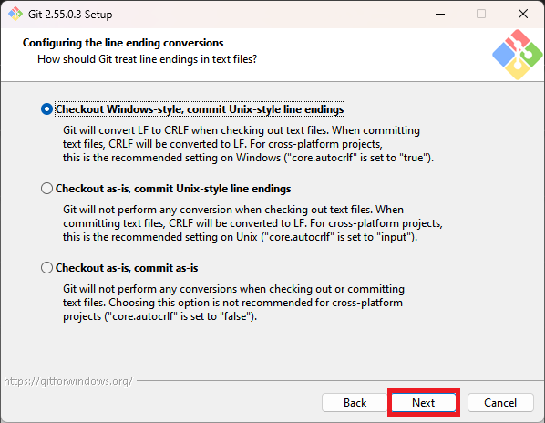
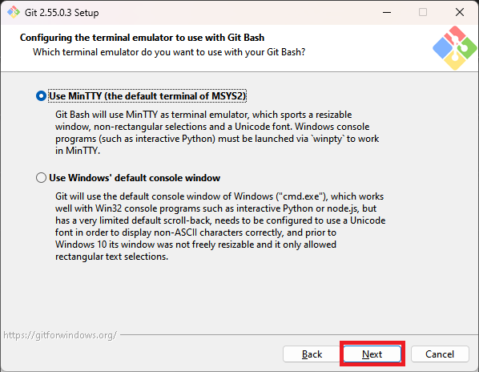
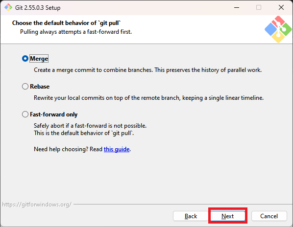
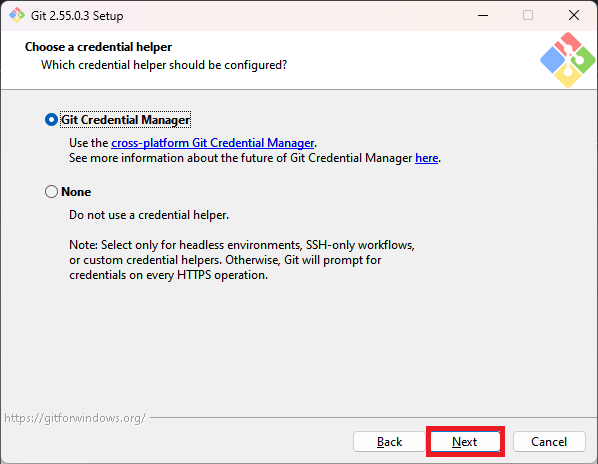
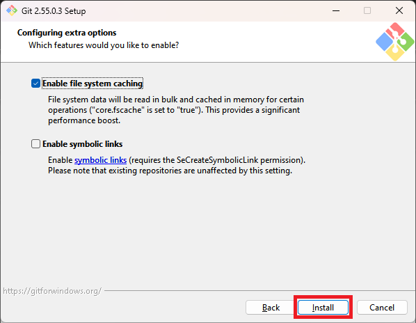
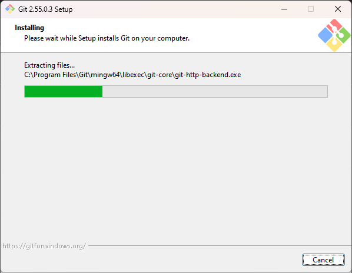
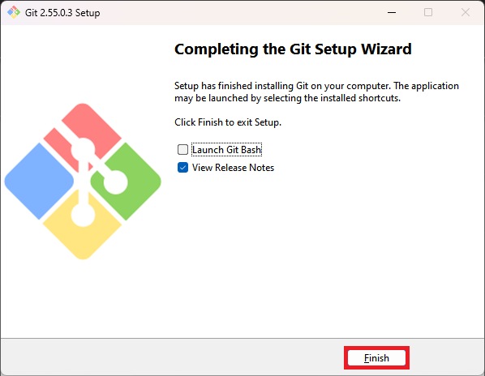

---

## Step 4: Create a GitHub Account

You need a free GitHub account so you can create private repositories and share them with me.

1. Go to: [https://github.com/signup](https://github.com/signup)
2. Enter your email address, create a password, and choose a username.
3. Follow the steps until your account is created and you are logged in.

**Enter your details instead of mine**

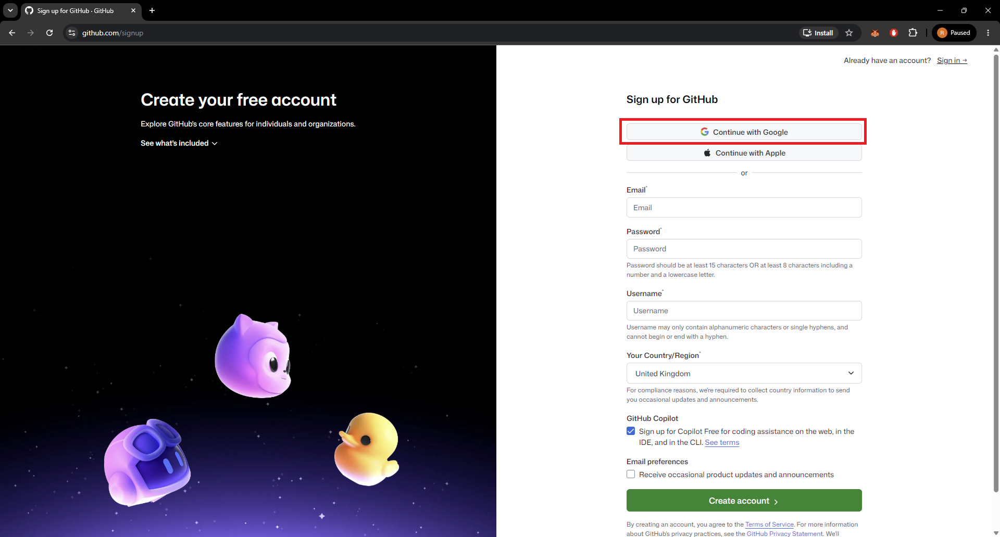
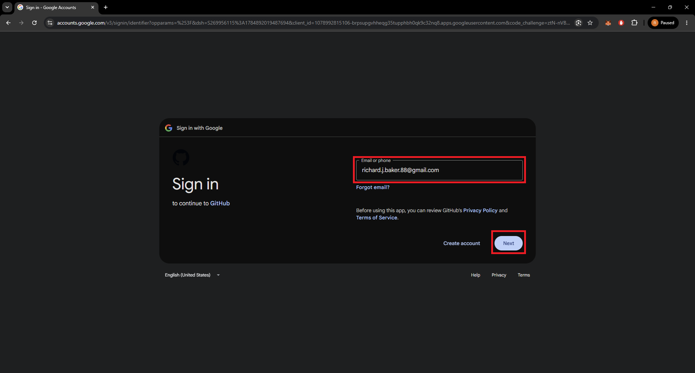
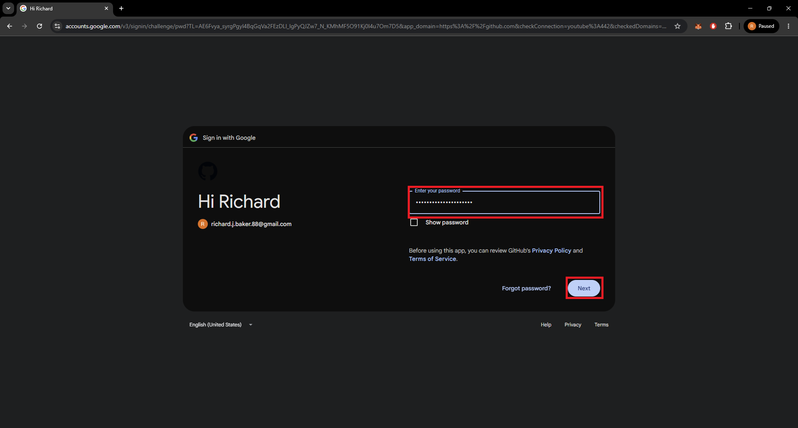
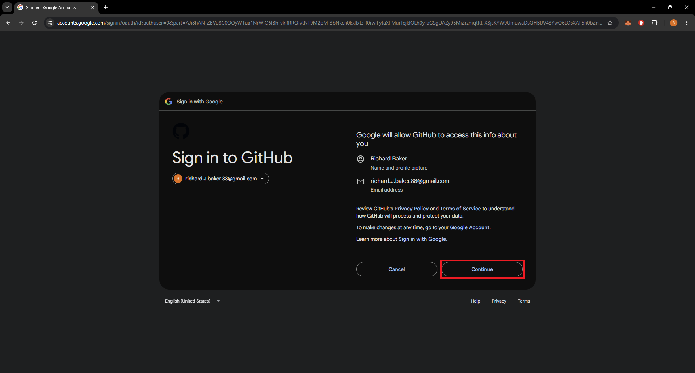
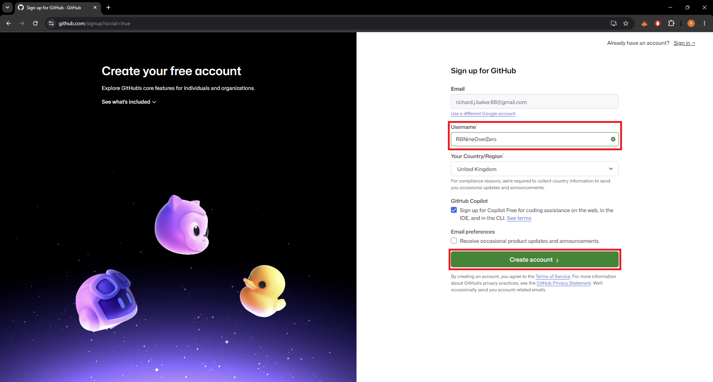
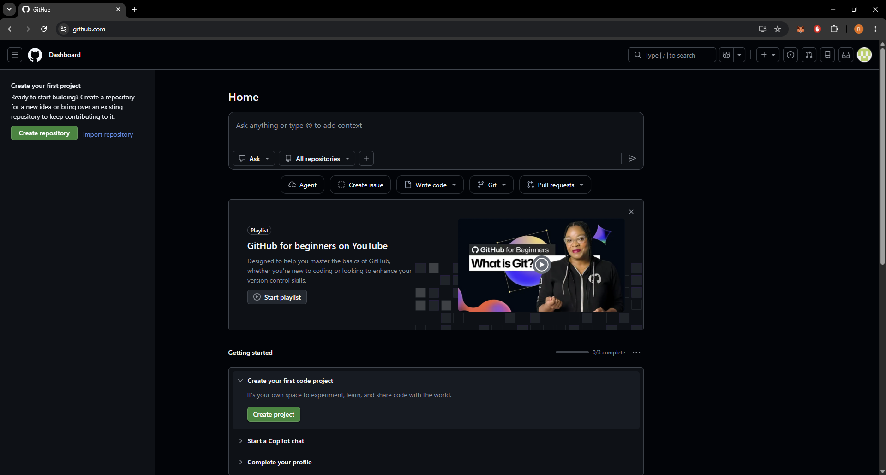

---

← **[Return to Preparation](../../README.md#preparation--install-the-tools-first)**