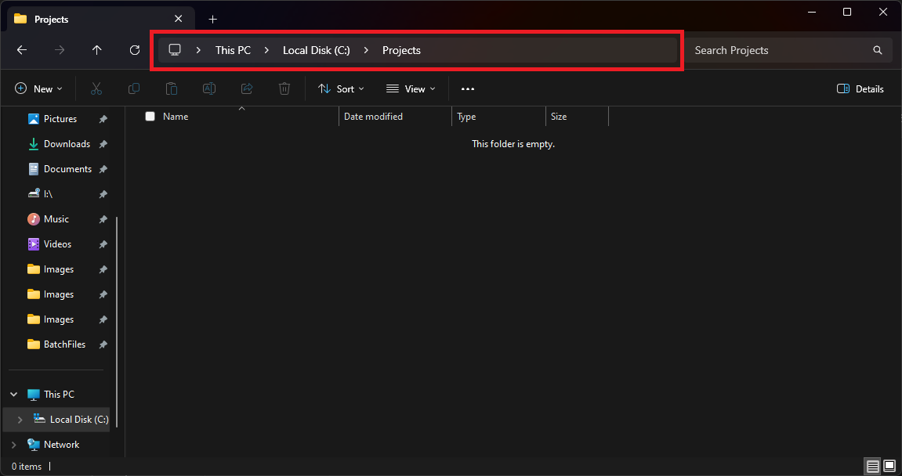
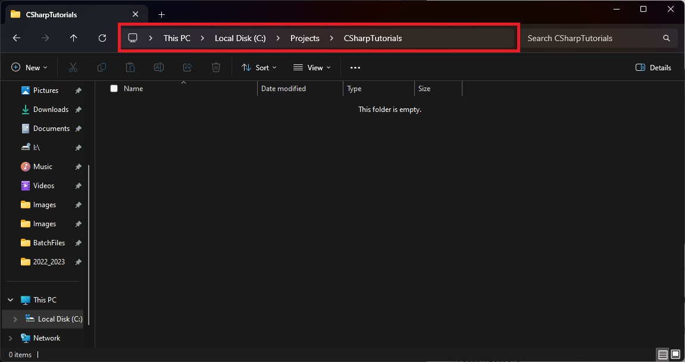
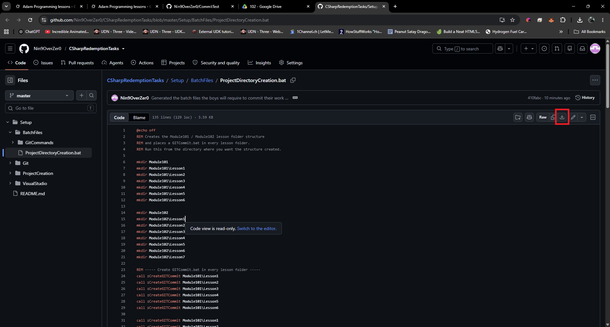
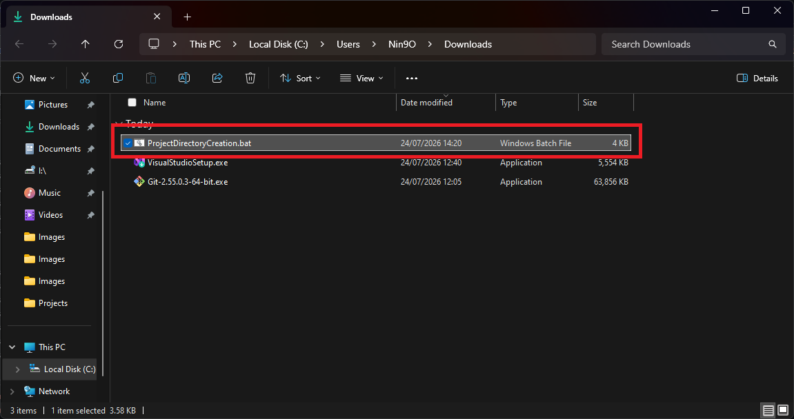
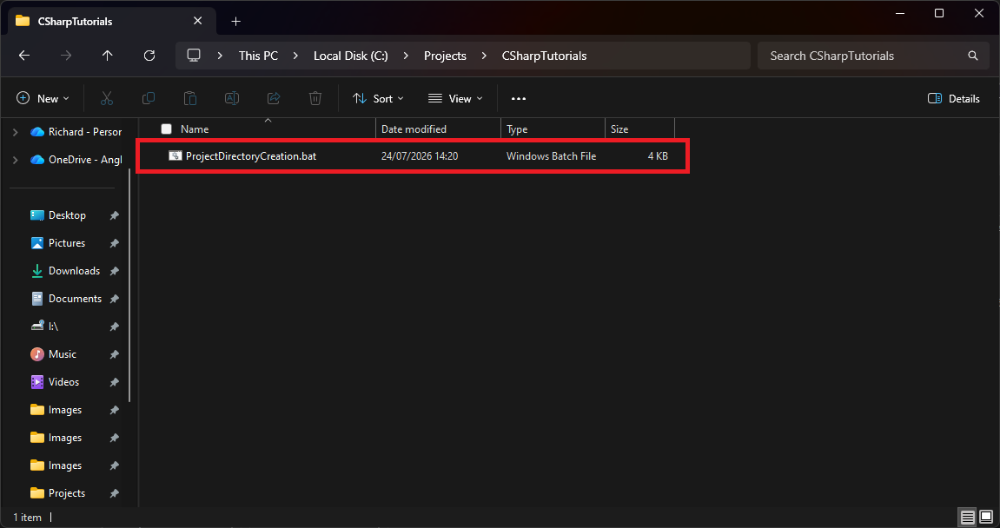

# Project Creation Setup

This guide will help you create the correct folder structure for the C# tutorials.

Follow each step carefully. Screenshots are included so you can check you are doing it correctly.

---

## Step 1: Create a Projects Folder

Create a folder called **Projects** in a location that makes sense on your computer.

- Preferably on the **D: drive** if you have one.
- If you only have a C: drive (like many laptops), just create it on the C: drive.

Example locations:
- `D:\Projects`
- `C:\Projects`



---

## Step 2: Create the CSharpTutorials Folder

Inside the **Projects** folder you just created, make a new folder called:

```text
CSharpTutorials
```

Your path should now look something like:

- `D:\Projects\CSharpTutorials`
- or `C:\Projects\CSharpTutorials`



---

## Step 3: Download the Batch File

Download the following file:

[https://github.com/Nin9OverZer0/CSharpRedemptionTasks/blob/master/Setup/BatchFiles/ProjectDirectoryCreation.bat](https://github.com/Nin9OverZer0/CSharpRedemptionTasks/blob/master/Setup/BatchFiles/ProjectDirectoryCreation.bat)

Click the download button on the page.



---

## Step 4: Copy the File into CSharpTutorials

1. Go to your **Downloads** folder.
2. Find the file `ProjectDirectoryCreation.bat`.
3. Copy it.
4. Paste it into the **CSharpTutorials** folder you created earlier.



---

## Step 5: Run the Batch File

Double-click `ProjectDirectoryCreation.bat` inside the CSharpTutorials folder.

It will automatically create the full folder structure for all the lessons and also add extra batch files that you will use later for committing your work.



---

## Done

Your project folders are now ready.

You can return to the main page:

← **[Return to Preparation](../../README.md#preparation--install-the-tools-first)**
