# Visual Studio Setup

This guide will walk you through installing **Visual Studio Community** (the free version) on Windows.

You only need to do this once.  
Follow every step carefully and use the screenshots to check you are on the right screen.

---

## Step 1: Download Visual Studio Community

Go to the official download page:

[https://visualstudio.microsoft.com/vs/community/](https://visualstudio.microsoft.com/vs/community/)

Click the free download button.

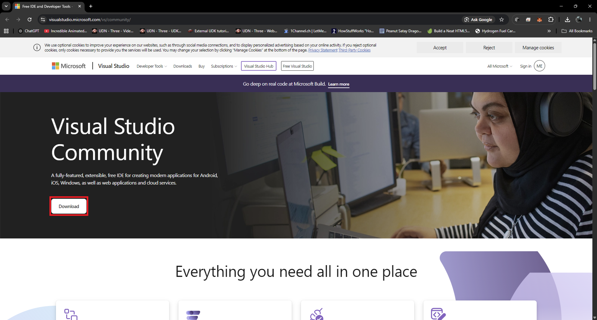

---

## Step 2: Run the Visual Studio Installer

Find the downloaded file (usually in your Downloads folder) and double-click it.

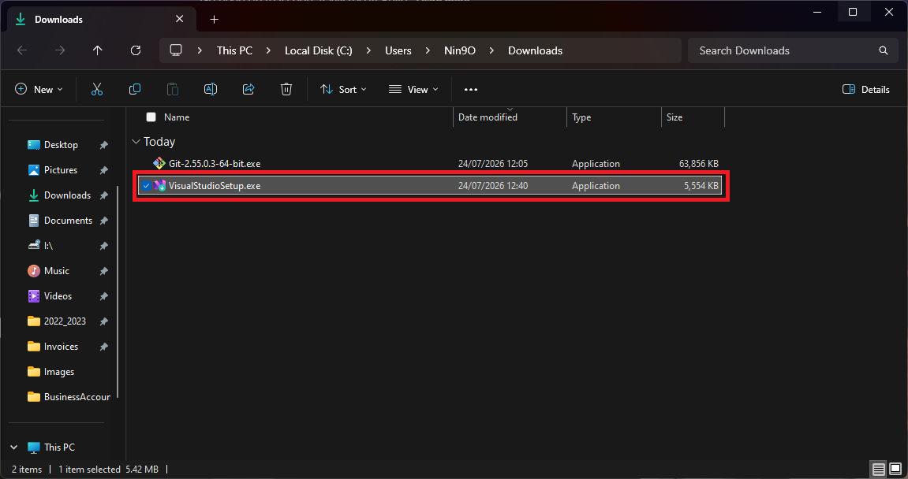
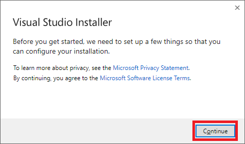
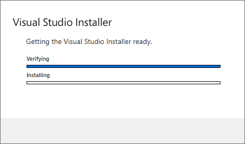
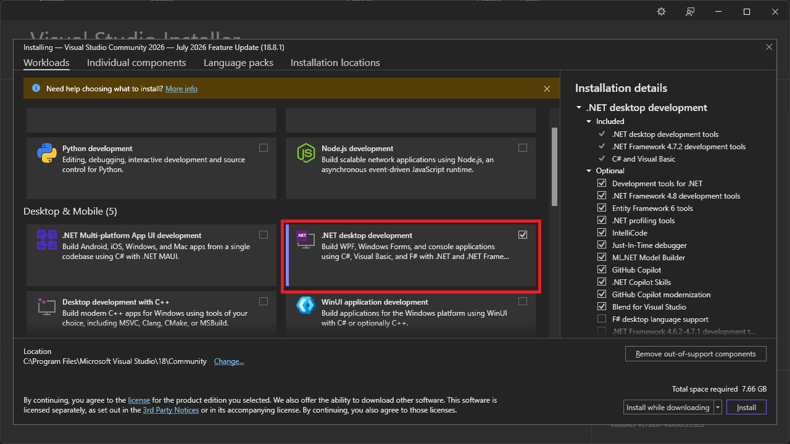
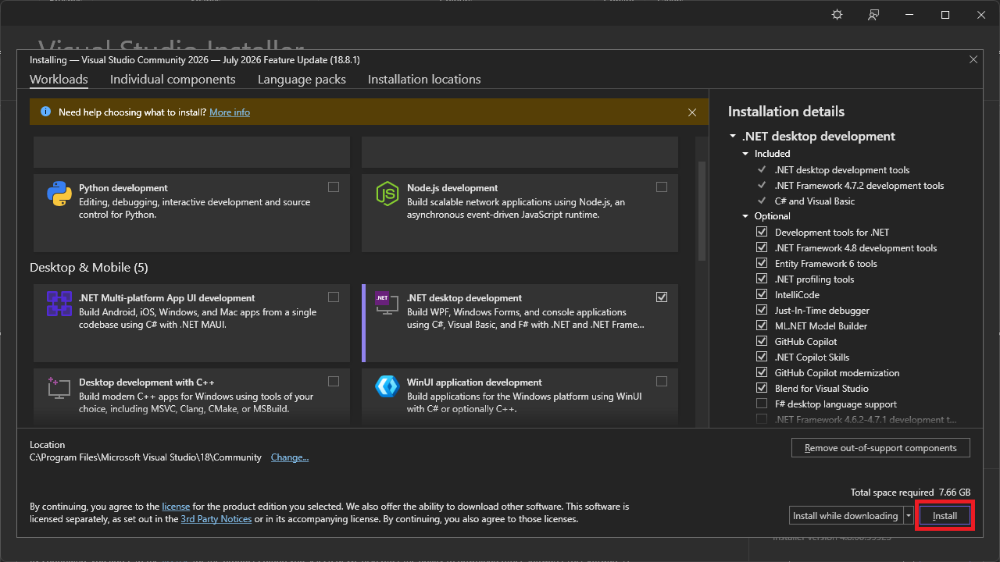
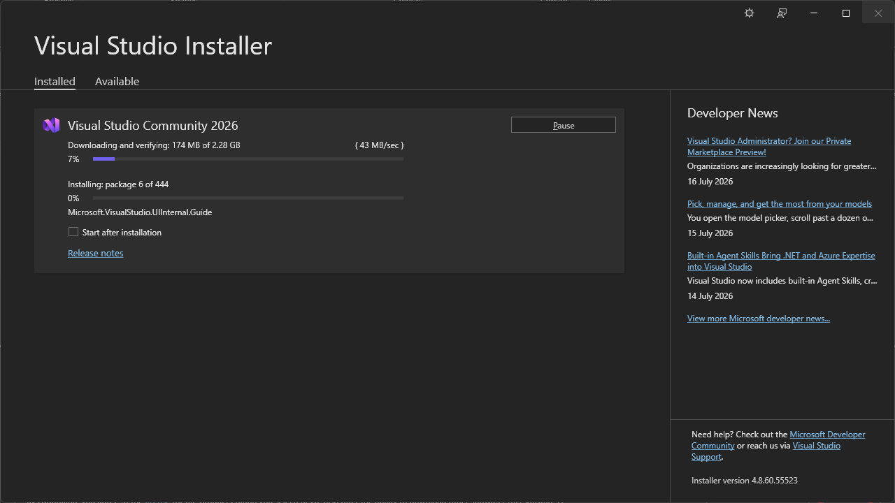
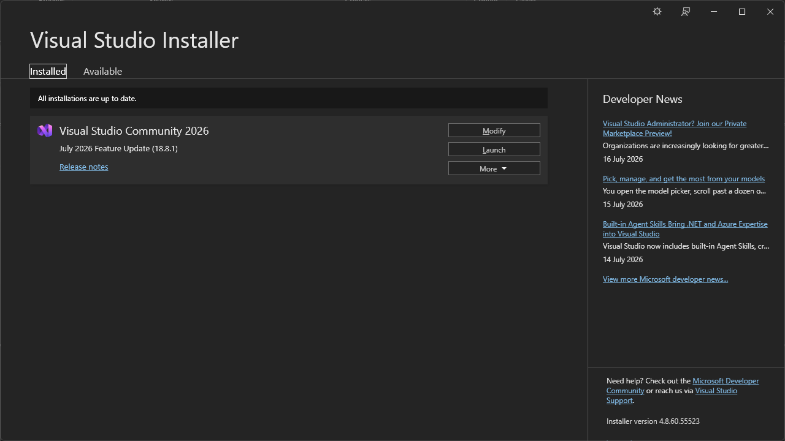

---

## Step 3: Open Visual Studio and Login

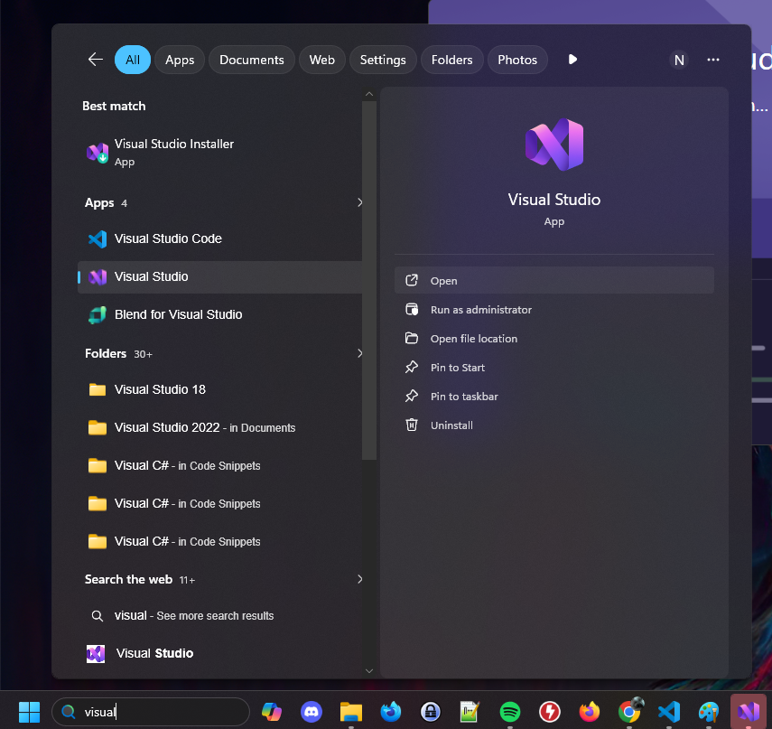
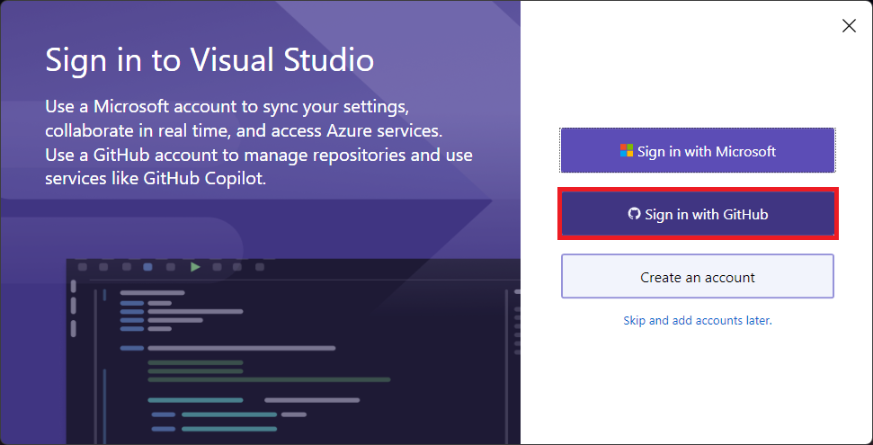
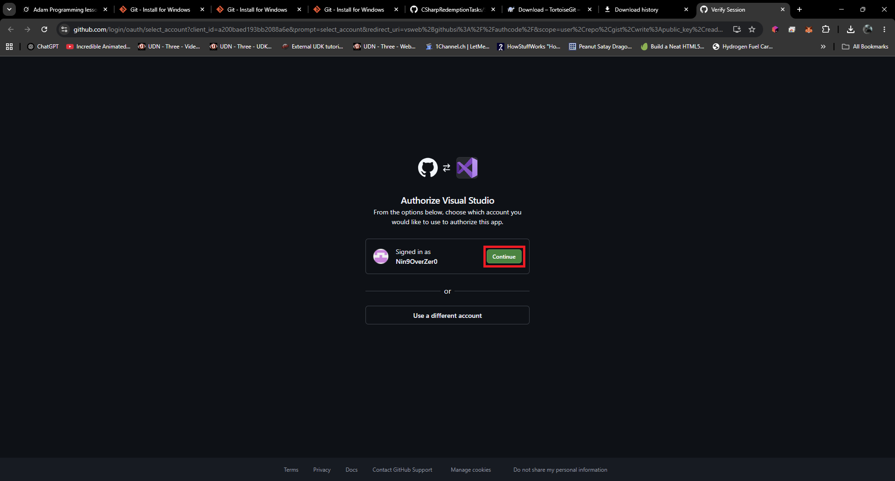
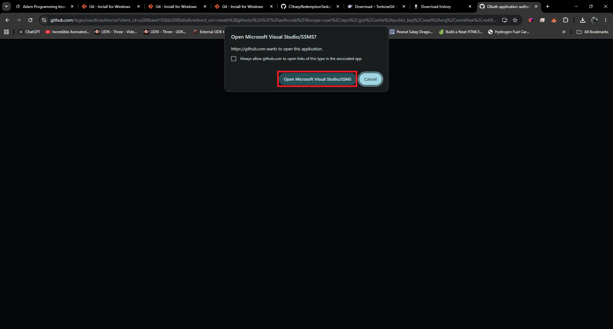
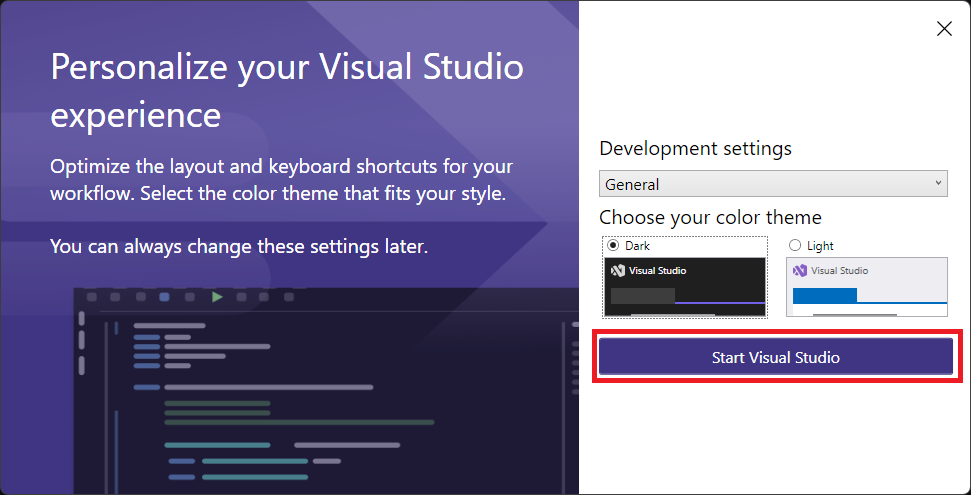
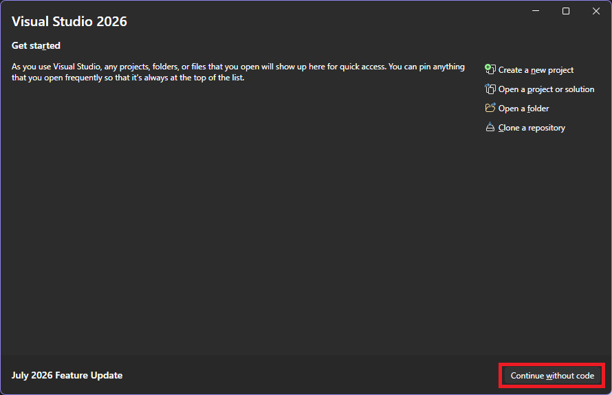
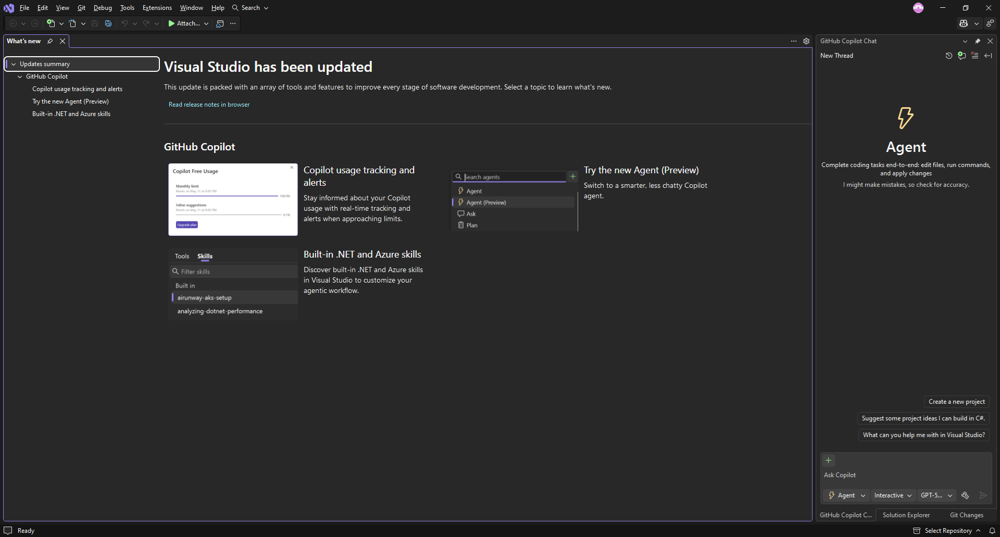

---

## Step 4: Disable Copilot

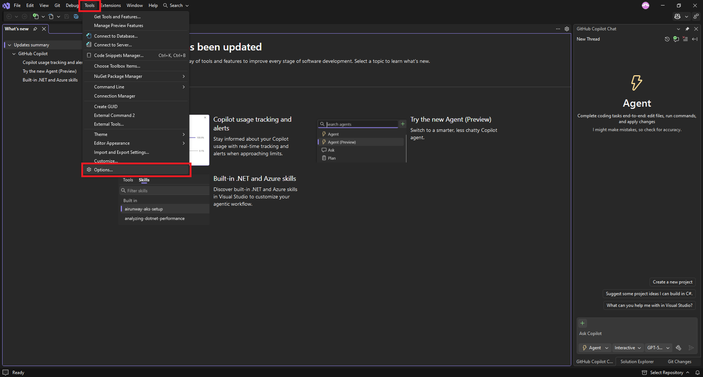
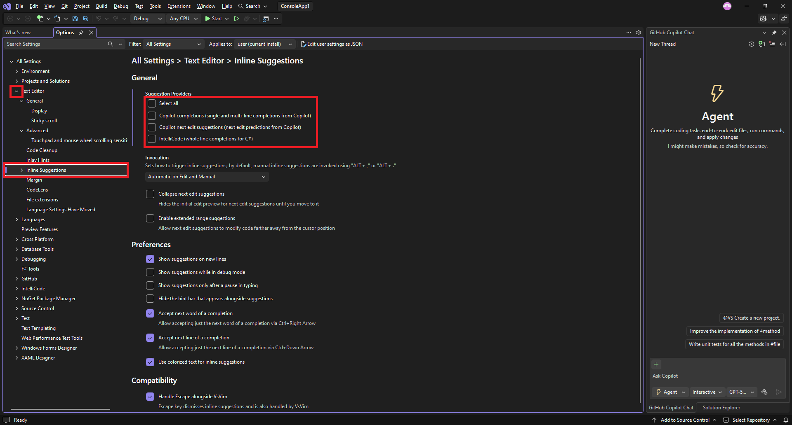
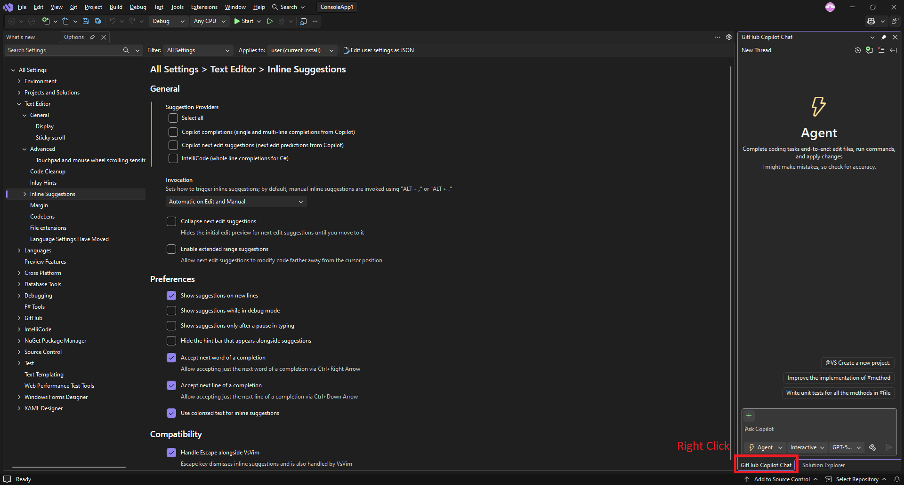
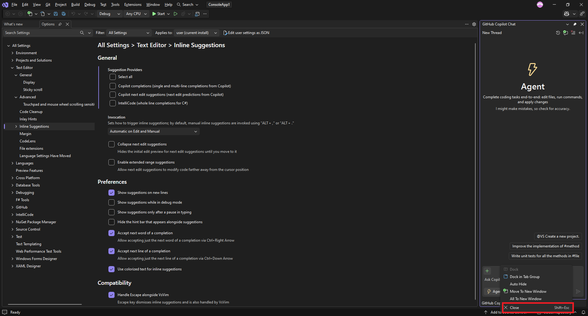

---

## Done

Visual Studio Community is now installed and ready to use.

You can return to the main page:

→ **[Project Creation Setup](../ProjectCreation/Setup.md)**

← **[Return to Preparation](../../README.md#preparation--install-the-tools-first)**